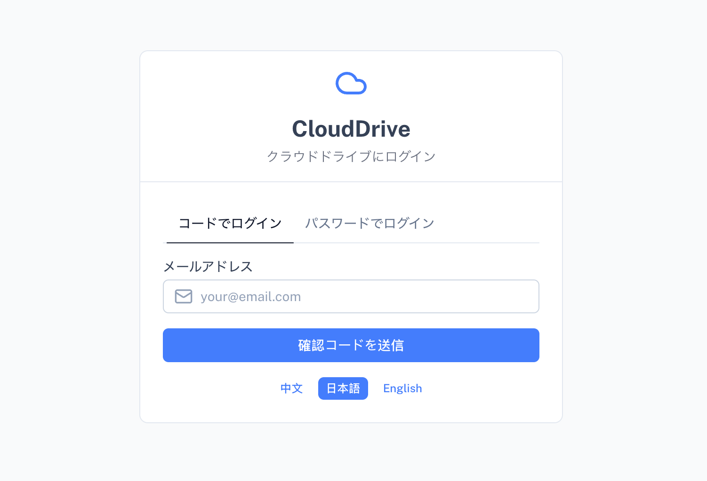
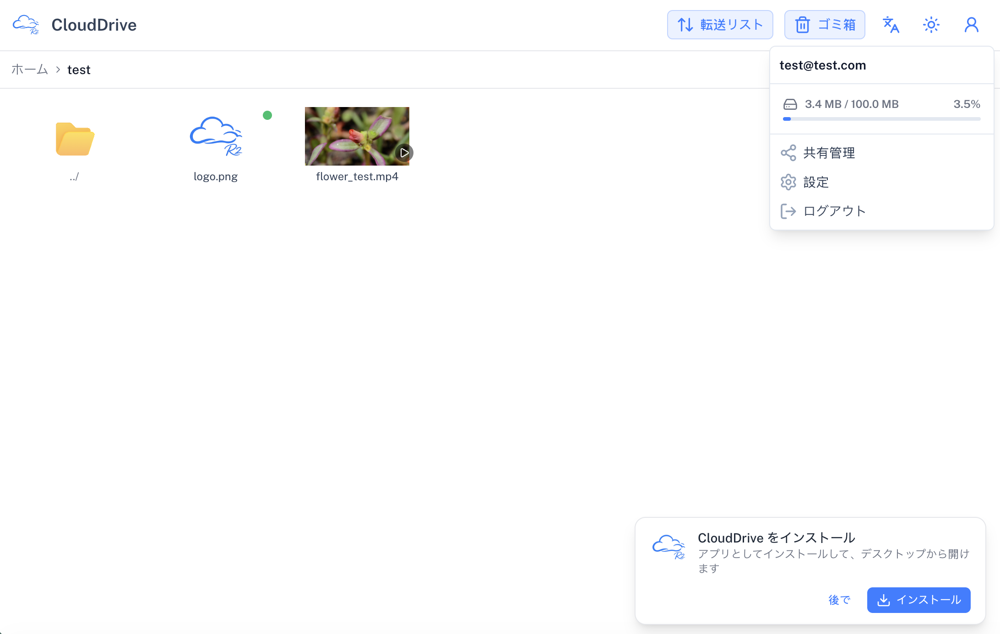

# CloudDrive R2

個人用プライベートクラウドドライブ PWA（Nuxt 4 + Cloudflare Workers + D1 + R2）。

## プレビュー

- URL: https://r2drive.orange-trees.com/

## テストアカウント

| 種別 | ユーザー名 | パスワード | 備考 |
|------|-----------|-----------|------|
| テストユーザー | `test` | `test` | ストレージ上限 **100MB 固定**（変更不可） |

> テストユーザーはストレージ上限が 100MB に固定されており、設定画面から変更することはできません。
> また、システム内の「テストユーザー」グループに所属しており、ストレージ上限・分割サイズ・パスワード変更はシステム管理者が一括管理します（設定画面からは変更不可）。




## 機能

- ファイル / フォルダのアップロード・ダウンロード・移動・コピー・削除（ごみ箱）
- マルチユーザー対応（ユーザーごとにファイル・フォルダを完全分離）
- メール検証コード / ユーザー名 + パスワードでのログイン
- 共有機能（ファイル / フォルダをリンクで共有）
  - パスワード保護（6 桁 PIN、一度入力すれば次回以降は入力不要）
  - 有効期限設定（時間 / 日、最大 100、無期限も可）
  - 共有リンク管理（共有一覧・取消・リンクコピー）
  - 公開ページでの複数選択 + ZIP 一括ダウンロード、ファイルのプレビュー
- ファイル索引（IndexedDB にローカル保存、毎日自動で全量同期）
- プレビューキャッシュ（IndexedDB、最大容量・対象タイプを設定可能）
- ソート機能（名前 / サイズ / タイプ / 更新日時、昇順・降順）
- 多言語対応（日本語 / 中文 / English）
- ダークモード対応
- **ロール権限管理（管理者 / 一般ユーザー）**
  - システム内の最初に登録したユーザーが自動的に管理者、以降のユーザーは一般ユーザー
  - 管理者は右上メニューのユーザー管理から一般ユーザーへの管理者権限の付与・取り消しが可能
  - 管理者には右上メニューに `admin` バッジを表示
- **ユーザーグループ管理（管理者のみ）**
  - 管理者がユーザーグループを作成・編集・削除（ストレージ上限・パスワード変更可否・分割サイズを一括設定）
  - ユーザーをグループに割り当てると、ストレージ上限 / 分割サイズ / パスワード変更は
    システム管理者が一括管理となり、設定画面からは変更不可（「システム管理者が一括管理」と表示）
- PWA

## 技術スタック

- Nuxt 4 + Vue 3 + Nuxt UI v4
- Cloudflare Workers + D1 + R2
- better-auth（メール OTP + ユーザー名 / パスワード認証）
- JSZip（共有 ZIP 一括ダウンロード）
- TypeScript + ESLint

## 開発環境デバッグ（D1 / R2 バインディング統一）

リモート API（d1-http / S3）は使わず、Cloudflare bindings（`env.DB`、`env.R2`）経由で
データベースとオブジェクトストレージにアクセスします。ローカル開発と本番は同じコードパスです。

- `pnpm dev`：Nitro が `wrangler.getPlatformProxy()` でローカル Miniflare を起動し、
  ルートの `wrangler.toml` に基づく**ローカル D1 + R2 バインディング**を提供します
  （`.wrangler/state/v3` に永続化。クラウドにはアクセスしません）。
  ※ `wrangler.toml` の各バインディングに `remote = true` を付けると開発時も**クラウド**の D1 / R2 を直結します。
  ※ データベースの初期化は下記「データベース初期化」を参照（`server/db/init.sql` を使用）。
- `pnpm build && pnpm dev:remote`：`wrangler dev --remote` で**リモート**の D1 / R2 に接続してデバッグ。
- デプロイ：`pnpm build` 後に `wrangler deploy`（または NuxtHub 経由）。コードパスは同一です。

| リソース | バインディング | ローカル永続化 |
|---------|--------------|---------------|
| データベース | `env.DB`（D1） | `.wrangler/state/v3` |
| オブジェクトストレージ | `env.R2`（R2 Bucket） | `.wrangler/state/v3` |

> 注：R2 binding は S3 プリサイン URL をサポートしていないため、分割アップロードは
> Worker 経由（`POST /api/upload/part` → `env.R2.uploadPart`）で行います。

---

## セットアップ

依存関係をインストールします:

```bash
pnpm install
```

## データベース初期化（init.sql 統一）

データベースの初期化は **`server/db/init.sql` のみ**を使用します
（唯一の権威ソース・**冪等**：何度でも安全に実行可能。全テーブルをカバー）。

ローカル D1:

```bash
npx wrangler d1 execute clouddrive-db --local --file=server/db/init.sql
```

クラウド D1:

```bash
npx wrangler d1 execute clouddrive-db --remote --file=server/db/init.sql
```

> `drizzle/` 配下のマイグレーションは drizzle-kit の差分 SQL 生成用の参考であり、
> デプロイ / 初期化には使いません（`drizzle-kit migrate` は不要）。
>
> ローカル D1 をリセットする場合は `.wrangler/state/v3` を削除してから上記ローカルコマンドを再実行します。

## 開発サーバー

`http://localhost:3000` で開発サーバーを起動します:

```bash
pnpm dev
```

## 本番ビルド

本番用にビルドします:

```bash
pnpm build
```

本番ビルドをローカルでプレビュー:

```bash
pnpm preview
```

## デプロイ（Cloudflare Workers）

### 1. リソース準備

- Cloudflare アカウントを作成し `npx wrangler login` で認証します。
- D1 データベースと R2 バケットを作成します:

```bash
npx wrangler d1 create clouddrive-db
npx wrangler r2 bucket create clouddrive-files
```

- 作成した D1 の `database_id` と R2 バケット名 / バインディングを `wrangler.toml` に反映します。

### 2. 環境変数 / シークレット

`wrangler.toml` の `[vars] BETTER_AUTH_URL` を実際のデプロイ URL（例: `https://clouddrive.example.com`）に変更します。

シークレットを設定します:

```bash
npx wrangler secret put BETTER_AUTH_SECRET       # Better Auth 署名用ランダム文字列
npx wrangler secret put CLOUDFLARE_ACCOUNT_ID    # メール送信（Cloudflare Email Service）用アカウント ID
npx wrangler secret put CF_API_TOKEN_SEND_EMAIL  # メール送信用 API トークン
```

メール送信元は `EMAIL_FROM`（デフォルト `no-reply@yourdomain.com`）で指定します。

### 3. データベース初期化

```bash
npx wrangler d1 execute clouddrive-db --remote --file=server/db/init.sql
```

### 4. R2 CORS 設定（必須）

分割アップロードの分片直送（ブラウザ → R2 PUT）ができるよう、R2 バケットの CORS を設定します:
- AllowedMethods に `PUT` を含める
- ExposeHeaders に `ETag` を含める（フロントエンドが分片の ETag を読み取るため）
- AllowedOrigins に実デプロイ URL を許可する

### 5. ビルド & デプロイ

```bash
pnpm build
npx wrangler deploy
```

### 6. 初回アクセス

- デプロイ後、**最初に登録したユーザーが自動的に管理者**になります。
- 新規ユーザー登録はデフォルトでオフのため、新規ユーザーを受け入れる場合は
  管理者としてログインし「ユーザー管理」→「允许新用户注册」をオンにしてください。

詳細は [Nuxt デプロイメントドキュメント](https://nuxt.com/docs/getting-started/deployment) も参照してください。

## Renovate 連携

[Renovate GitHub app](https://github.com/apps/renovate/installations/select_target) をリポジトリにインストールすれば準備完了です。
