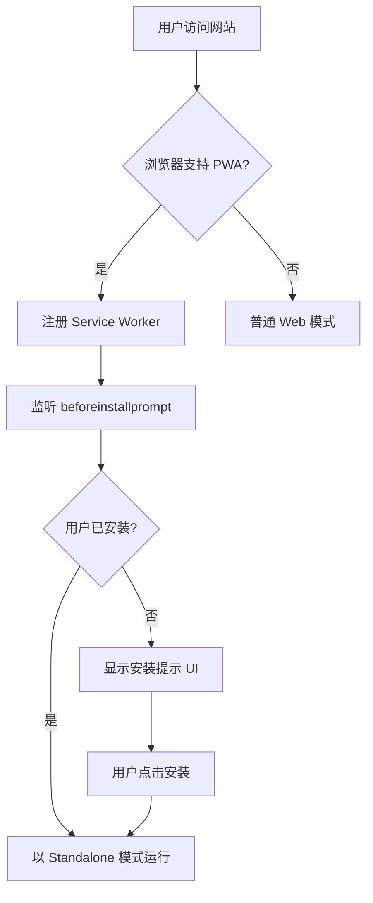
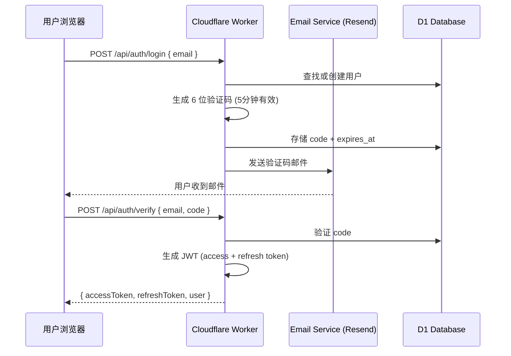
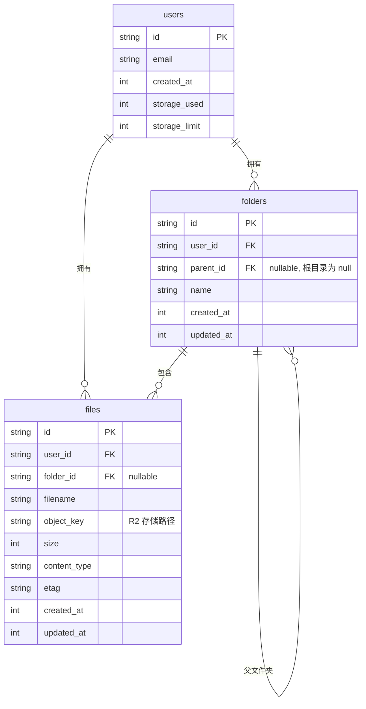
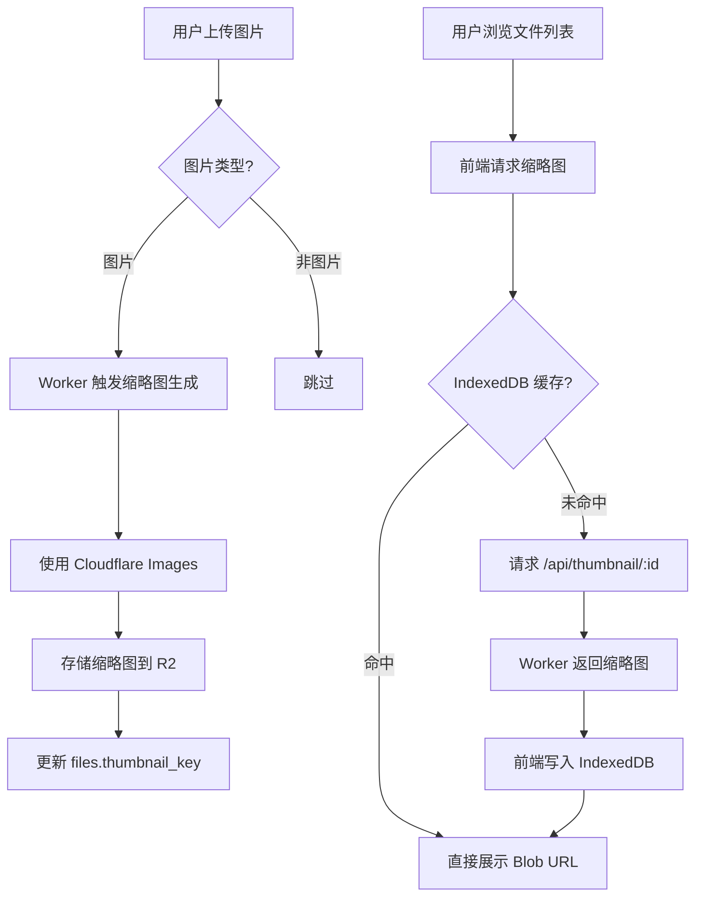
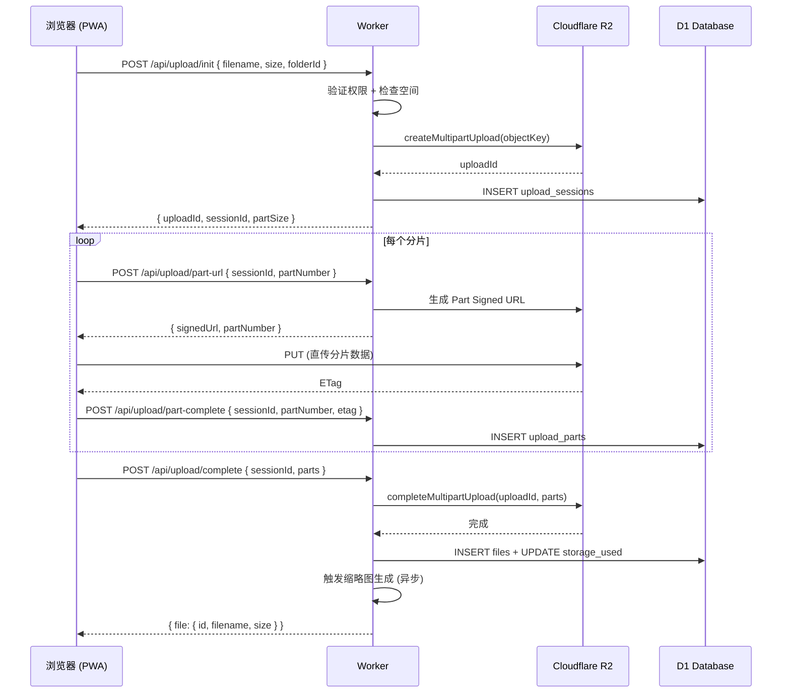
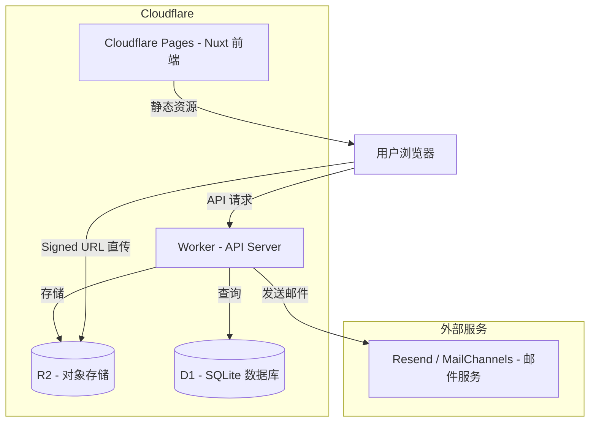

# CloudDrive R2 — 个人云盘 PWA 应用技术方案

> **定位**: 面向个人的私有云盘 Web 应用，支持 PWA 安装、邮箱登录、图片无限缓存、文件夹管理、移动端适配。

---

## 1. 项目概述

### 1.1 核心特性

| 特性 | 说明 |
|------|------|
| 🔐 邮箱登录鉴权 | 邮箱验证码 / Magic Link 免密登录 |
| 📱 PWA 安装 | Service Worker + Web App Manifest，可添加到桌面 |
| 🖼️ 图片无限缓存 | IndexedDB 本地缓存，永不清理，容量不限制 |
| 📁 文件夹管理 | 创建/重命名/删除/移动文件夹，支持嵌套 |
| ☁️ 云端存储 | Cloudflare R2 对象存储，文件直传 |
| 📤 大文件上传 | Signed URL + Multipart Upload，支持断点续传 |
| 📱 移动端适配 | 响应式布局 + 触摸手势 + 移动端 PWA |
| ⚡ 离线浏览 | 已缓存图片离线可查看 |

### 1.2 技术栈

```
┌─────────────────────────────────────────────┐
│                  前端 (Nuxt 3)                │
│  Vue 3 · TypeScript · Nuxt UI · Tailwind CSS  │
│  PWA Module · IndexedDB · Service Worker     │
├─────────────────────────────────────────────┤
│               后端 (Cloudflare Workers)       │
│  Hono / itty-router · TypeScript             │
│  JWT Auth · Email Service (Resend/MailChannels) │
├─────────────────────────────────────────────┤
│               存储 & 数据                      │
│  Cloudflare R2 (对象存储)                      │
│  Cloudflare D1 (SQLite 数据库)                 │
└─────────────────────────────────────────────┘
```

---

## 2. 整体架构

```
┌──────────────────────────────────────────────────────────────┐
│                        用户浏览器 (PWA)                        │
│  ┌──────────┐  ┌──────────┐  ┌──────────┐  ┌──────────────┐ │
│  │ 文件浏览  │  │ 图片查看  │  │ 文件上传  │  │ IndexedDB    │ │
│  │ (网格/列表)│  │ (懒加载)  │  │ (分片)    │  │ (图片缓存)   │ │
│  └──────────┘  └──────────┘  └──────────┘  └──────────────┘ │
│                        │                                      │
│              Service Worker (离线 & 缓存策略)                  │
└────────────────────────────┬─────────────────────────────────┘
                             │
                    HTTPS (JWT Token)
                             │
                             ▼
┌──────────────────────────────────────────────────────────────┐
│                    Cloudflare Worker                          │
│  ┌──────────┐  ┌──────────┐  ┌──────────┐  ┌──────────────┐ │
│  │ 鉴权中间件 │  │ 文件 API  │  │ 文件夹 API │  │ 上传 API     │ │
│  └──────────┘  └──────────┘  └──────────┘  └──────────────┘ │
└──────┬────────────────────┬──────────────────────────────────┘
       │                    │
       ▼                    ▼
┌──────────────┐    ┌──────────────┐
│  R2 (存储)    │    │  D1 (元数据)  │
│  文件/缩略图  │    │  用户/文件/文件夹│
└──────────────┘    └──────────────┘
```

### 2.1 请求路由设计

```
浏览器请求:

/api/auth/*          → Worker 鉴权处理 (login, verify, refresh, me)
/api/files/*         → Worker 文件 CRUD (list, get, delete, move, copy)
/api/folders/*       → Worker 文件夹 CRUD (create, rename, delete, list)
/api/upload/*        → Worker 上传管理 (init, part-url, complete, abort)
/api/thumbnail/*     → Worker 缩略图代理 (生成/缓存/返回)
```

---

## 3. PWA 支持

### 3.1 Web App Manifest

`public/manifest.json`:

```json
{
  "name": "CloudDrive R2",
  "short_name": "CloudDrive",
  "description": "个人私有云盘",
  "start_url": "/",
  "display": "standalone",
  "background_color": "#ffffff",
  "theme_color": "#3b82f6",
  "orientation": "any",
  "icons": [
    { "src": "/icons/icon-192.png", "sizes": "192x192", "type": "image/png" },
    { "src": "/icons/icon-512.png", "sizes": "512x512", "type": "image/png" },
    { "src": "/icons/icon-512-maskable.png", "sizes": "512x512", "type": "image/png", "purpose": "maskable" }
  ],
  "screenshots": [
    { "src": "/screenshots/desktop.png", "sizes": "1280x720", "type": "image/png", "form_factor": "wide" },
    { "src": "/screenshots/mobile.png", "sizes": "750x1334", "type": "image/png", "form_factor": "narrow" }
  ]
}
```

### 3.2 Nuxt PWA 配置

`nuxt.config.ts`:

```ts
export default defineNuxtConfig({
  modules: ['@vite-pwa/nuxt'],
  pwa: {
    registerType: 'autoUpdate',
    manifest: {
      name: 'CloudDrive R2',
      short_name: 'CloudDrive',
      theme_color: '#3b82f6',
      icons: [ /* 同上 */ ]
    },
    workbox: {
      globPatterns: ['**/*.{js,css,html,png,svg,ico}'],
      runtimeCaching: [
        {
          // 图片缩略图: Cache First (优先使用缓存)
          urlPattern: /\/api\/thumbnail\/.*/,
          handler: 'CacheFirst',
          options: {
            cacheName: 'thumbnails',
            expiration: { maxEntries: 500, maxAgeSeconds: 30 * 24 * 60 * 60 }
          }
        },
        {
          // API 请求: Network First (优先网络，失败回退缓存)
          urlPattern: /\/api\/(files|folders)\/.*/,
          handler: 'NetworkFirst',
          options: {
            cacheName: 'api-responses',
            networkTimeoutSeconds: 5,
            expiration: { maxEntries: 200, maxAgeSeconds: 60 * 60 }
          }
        }
      ]
    },
    client: {
      installPrompt: true
    }
  }
})
```

### 3.3 PWA 安装流程



---

## 4. 邮箱登录鉴权

### 4.1 认证流程

采用 **Magic Link 免密登录** 方案，用户无需记忆密码：



### 4.2 Worker 鉴权实现

```ts
// /api/auth/login.ts
import { Hono } from 'hono'
import { sign } from 'hono/jwt'

const auth = new Hono()

// Step 1: 发送验证码
auth.post('/login', async (c) => {
  const { email } = await c.req.json()

  // 校验邮箱格式
  if (!/^[^\s@]+@[^\s@]+\.[^\s@]+$/.test(email)) {
    return c.json({ error: '邮箱格式不正确' }, 400)
  }

  // 生成 6 位数字验证码
  const code = String(Math.floor(100000 + Math.random() * 900000))
  const expiresAt = Date.now() + 5 * 60 * 1000 // 5分钟

  // 存储到 D1
  await c.env.DB.prepare(
    `INSERT INTO auth_codes (email, code, expires_at) VALUES (?, ?, ?)
     ON CONFLICT(email) DO UPDATE SET code = ?, expires_at = ?`
  ).bind(email, code, expiresAt, code, expiresAt).run()

  // 发送邮件
  await sendVerificationEmail(email, code)

  return c.json({ message: '验证码已发送' })
})

// Step 2: 验证码校验 + 签发 JWT
auth.post('/verify', async (c) => {
  const { email, code } = await c.req.json()

  // 查询验证码
  const row = await c.env.DB.prepare(
    'SELECT code, expires_at FROM auth_codes WHERE email = ?'
  ).bind(email).first()

  if (!row || row.code !== code || Date.now() > row.expires_at) {
    return c.json({ error: '验证码无效或已过期' }, 401)
  }

  // 删除已使用的验证码
  await c.env.DB.prepare('DELETE FROM auth_codes WHERE email = ?').bind(email).run()

  // 查找或创建用户
  let user = await c.env.DB.prepare('SELECT * FROM users WHERE email = ?').bind(email).first()
  if (!user) {
    const id = crypto.randomUUID()
    await c.env.DB.prepare(
      'INSERT INTO users (id, email, created_at) VALUES (?, ?, ?)'
    ).bind(id, email, Date.now()).run()
    user = { id, email }
  }

  // 生成 JWT
  const accessToken = await sign(
    { sub: user.id, email: user.email, type: 'access' },
    c.env.JWT_SECRET,
  )

  const refreshToken = await sign(
    { sub: user.id, type: 'refresh' },
    c.env.JWT_REFRESH_SECRET,
  )

  return c.json({ accessToken, refreshToken, user: { id: user.id, email: user.email } })
})

// 鉴权中间件
export async function authMiddleware(c, next) {
  const authHeader = c.req.header('Authorization')
  if (!authHeader?.startsWith('Bearer ')) {
    return c.json({ error: '未登录' }, 401)
  }
  try {
    const payload = await verify(authHeader.slice(7), c.env.JWT_SECRET)
    c.set('userId', payload.sub)
    await next()
  } catch {
    return c.json({ error: 'Token 无效或已过期' }, 401)
  }
}
```

### 4.3 前端 Auth Store

```ts
// stores/auth.ts
export const useAuthStore = defineStore('auth', () => {
  const user = ref(null)
  const accessToken = useCookie('access_token')
  const refreshToken = useCookie('refresh_token')

  async function login(email: string) {
    await $fetch('/api/auth/login', { method: 'POST', body: { email } })
  }

  async function verify(email: string, code: string) {
    const res = await $fetch('/api/auth/verify', { method: 'POST', body: { email, code } })
    accessToken.value = res.accessToken
    refreshToken.value = res.refreshToken
    user.value = res.user
  }

  async function logout() {
    accessToken.value = null
    refreshToken.value = null
    user.value = null
    navigateTo('/login')
  }

  // 自动刷新 Token
  async function refreshAccessToken() {
    try {
      const res = await $fetch('/api/auth/refresh', {
        method: 'POST',
        body: { refreshToken: refreshToken.value }
      })
      accessToken.value = res.accessToken
    } catch {
      logout()
    }
  }

  return { user, login, verify, logout, refreshAccessToken, accessToken }
})
```

---

## 5. IndexedDB 图片本地缓存

### 5.1 设计原则

> **永不驱逐、容量不限** — 所有已浏览的图片原图和缩略图永久存储在 IndexedDB 中。

| 策略 | 说明 |
|------|------|
| **写入策略** | 每次浏览图片时自动写入 IndexedDB |
| **驱逐策略** | 不驱逐，不清除（用户可手动清理） |
| **容量策略** | IndexedDB 由浏览器管理，Chrome 可达磁盘 80%，无硬上限 |
| **读取策略** | Cache First：先查 IndexedDB，未命中再请求网络 |
| **存储内容** | 缩略图 (Blob) + 原图 (Blob，可选按需缓存) |

### 5.2 IndexedDB 封装

```ts
// utils/idb-cache.ts

const DB_NAME = 'clouddrive-cache'
const DB_VERSION = 1

interface CacheEntry {
  id: string          // file_id
  blob: Blob
  contentType: string
  size: number
  cachedAt: number
  type: 'thumbnail' | 'original'
}

class ImageCache {
  private db: IDBDatabase | null = null

  async open(): Promise<IDBDatabase> {
    if (this.db) return this.db

    return new Promise((resolve, reject) => {
      const request = indexedDB.open(DB_NAME, DB_VERSION)

      request.onupgradeneeded = () => {
        const db = request.result
        if (!db.objectStoreNames.contains('images')) {
          const store = db.createObjectStore('images', { keyPath: 'id' })
          store.createIndex('type', 'type', { unique: false })
          store.createIndex('cachedAt', 'cachedAt', { unique: false })
        }
      }

      request.onsuccess = () => {
        this.db = request.result
        resolve(this.db)
      }

      request.onerror = () => reject(request.error)
    })
  }

  // 存储图片
  async put(entry: CacheEntry): Promise<void> {
    const db = await this.open()
    return new Promise((resolve, reject) => {
      const tx = db.transaction('images', 'readwrite')
      tx.objectStore('images').put(entry)
      tx.oncomplete = () => resolve()
      tx.onerror = () => reject(tx.error)
    })
  }

  // 读取图片
  async get(id: string): Promise<CacheEntry | undefined> {
    const db = await this.open()
    return new Promise((resolve, reject) => {
      const tx = db.transaction('images', 'readonly')
      const request = tx.objectStore('images').get(id)
      request.onsuccess = () => resolve(request.result)
      request.onerror = () => reject(request.error)
    })
  }

  // 批量读取
  async getMany(ids: string[]): Promise<Map<string, CacheEntry>> {
    const db = await this.open()
    const result = new Map<string, CacheEntry>()
    return new Promise((resolve, reject) => {
      const tx = db.transaction('images', 'readonly')
      const store = tx.objectStore('images')
      let count = ids.length
      for (const id of ids) {
        const req = store.get(id)
        req.onsuccess = () => {
          if (req.result) result.set(id, req.result)
          count--
          if (count === 0) resolve(result)
        }
        req.onerror = () => { count--; if (count === 0) resolve(result) }
      }
    })
  }

  // 获取缓存统计
  async getStats(): Promise<{ count: number; totalSize: number }> {
    const db = await this.open()
    return new Promise((resolve, reject) => {
      const tx = db.transaction('images', 'readonly')
      const store = tx.objectStore('images')
      const countReq = store.count()
      let totalSize = 0
      const cursorReq = store.openCursor()

      countReq.onsuccess = () => {
        cursorReq.onsuccess = (e) => {
          const cursor = (e.target as IDBRequest).result
          if (cursor) {
            totalSize += cursor.value.size
            cursor.continue()
          } else {
            resolve({ count: countReq.result, totalSize })
          }
        }
      }
    })
  }

  // 手动清除全部缓存（用户主动操作）
  async clearAll(): Promise<void> {
    const db = await this.open()
    return new Promise((resolve, reject) => {
      const tx = db.transaction('images', 'readwrite')
      tx.objectStore('images').clear()
      tx.oncomplete = () => resolve()
      tx.onerror = () => reject(tx.error)
    })
  }

  // 删除指定缓存
  async delete(id: string): Promise<void> {
    const db = await this.open()
    return new Promise((resolve, reject) => {
      const tx = db.transaction('images', 'readwrite')
      tx.objectStore('images').delete(id)
      tx.oncomplete = () => resolve()
      tx.onerror = () => reject(tx.error)
    })
  }
}

export const imageCache = new ImageCache()
```

### 5.3 图片加载策略

```ts
// composables/useImageLoader.ts

export function useImageLoader() {
  const cache = imageCache

  /**
   * 加载图片缩略图（Cache First 策略）
   * 1. 查 IndexedDB → 命中则直接返回 Blob URL
   * 2. 未命中 → 请求 Worker API，获取后存入 IndexedDB
   */
  async function loadThumbnail(fileId: string): Promise<string> {
    // Step 1: 查缓存
    const cached = await cache.get(`thumb:${fileId}`)
    if (cached) {
      return URL.createObjectURL(cached.blob)
    }

    // Step 2: 请求网络
    const token = useAuthStore().accessToken
    const response = await fetch(`/api/thumbnail/${fileId}`, {
      headers: { Authorization: `Bearer ${token}` }
    })

    if (!response.ok) throw new Error('加载失败')

    const blob = await response.blob()

    // Step 3: 写入 IndexedDB（永久存储）
    await cache.put({
      id: `thumb:${fileId}`,
      blob,
      contentType: blob.type,
      size: blob.size,
      cachedAt: Date.now(),
      type: 'thumbnail'
    })

    return URL.createObjectURL(blob)
  }

  /**
   * 加载原图（按需缓存）
   */
  async function loadOriginal(fileId: string): Promise<string> {
    const cached = await cache.get(`orig:${fileId}`)
    if (cached) {
      return URL.createObjectURL(cached.blob)
    }

    const token = useAuthStore().accessToken
    const response = await fetch(`/api/files/${fileId}/download`, {
      headers: { Authorization: `Bearer ${token}` }
    })

    const blob = await response.blob()

    // 存储原图
    await cache.put({
      id: `orig:${fileId}`,
      blob,
      contentType: blob.type,
      size: blob.size,
      cachedAt: Date.now(),
      type: 'original'
    })

    return URL.createObjectURL(blob)
  }

  /**
   * 检查是否已缓存
   */
  async function isCached(fileId: string, type: 'thumb' | 'orig' = 'thumb'): Promise<boolean> {
    const entry = await cache.get(`${type}:${fileId}`)
    return !!entry
  }

  return { loadThumbnail, loadOriginal, isCached }
}
```

### 5.4 IndexedDB vs Service Worker 缓存分工

```
┌─────────────────────────────────────────────────────────────┐
│                      缓存分工                                │
├──────────────────┬──────────────────────────────────────────┤
│  IndexedDB       │  Service Worker Cache API                │
├──────────────────┼──────────────────────────────────────────┤
│ 图片缩略图       │  JS/CSS/HTML 静态资源                     │
│ 图片原图         │  Font 字体文件                            │
│ 持久化 / 不驱逐  │  API 响应（短期）                         │
│ 用户数据层缓存   │  应用壳（App Shell）                       │
│ 可编程查询       │  自动拦截请求                             │
└──────────────────┴──────────────────────────────────────────┘
```

---

## 6. 文件与文件夹管理

### 6.0 为什么需要 D1 存储元数据

> R2 的 `user123/photos/vacation.jpg` 只是 key 命名约定，并非真正的文件夹。

| 操作 | 纯 R2 key 前缀方案 | R2 + D1 方案 |
|------|-------------------|-------------|
| **列出文件夹内容** | `ListObjects(prefix)` 一次 API 调用 | 一次 SQL 查询 |
| **文件夹重命名** | ❌ 需逐个 copy+delete 所有子对象，O(n) 次 R2 操作 | ✅ `UPDATE folders SET name=?` 一行 SQL |
| **文件夹移动** | ❌ 同上，且跨"目录"操作更复杂 | ✅ `UPDATE folders SET parent_id=?` |
| **搜索文件** | ❌ 无法按文件名/类型搜索 | ✅ `WHERE filename LIKE '%keyword%'` |
| **按日期/大小排序** | ❌ ListObjects 只按 key 字典序 | ✅ `ORDER BY created_at DESC` |
| **分页浏览** | ⚠️ 仅游标翻页，无法跳页 | ✅ `LIMIT ? OFFSET ?` |
| **统计存储用量** | ❌ 需遍历全部对象累加 | ✅ `SUM(size)` 实时计算 |
| **上传分片追踪** | ❌ 无处记录 part ETag | ✅ `upload_parts` 表 |

**核心原因**：R2 没有"移动/重命名对象"的原语——它只有 PUT/GET/DELETE。重命名一个"文件夹"意味着对下面每个对象执行 GET + PUT + DELETE，按 R2 的计费模型（Class A 操作收费），这是一个昂贵且缓慢的操作。D1 将文件组织关系从物理存储路径中解耦，元数据操作 O(1)，文件内容无需移动。

### 6.1 数据模型



### 6.2 D1 数据库完整 Schema

```sql
-- 用户表
CREATE TABLE users (
  id TEXT PRIMARY KEY,
  email TEXT UNIQUE NOT NULL,
  storage_used INTEGER DEFAULT 0,
  storage_limit INTEGER DEFAULT 10737418240,  -- 默认 10GB
  created_at INTEGER NOT NULL
);

-- 验证码表
CREATE TABLE auth_codes (
  email TEXT PRIMARY KEY,
  code TEXT NOT NULL,
  expires_at INTEGER NOT NULL
);

-- 文件夹表
CREATE TABLE folders (
  id TEXT PRIMARY KEY,
  user_id TEXT NOT NULL REFERENCES users(id),
  parent_id TEXT REFERENCES folders(id) ON DELETE CASCADE,
  name TEXT NOT NULL,
  created_at INTEGER NOT NULL,
  updated_at INTEGER NOT NULL
);
CREATE INDEX idx_folders_user_parent ON folders(user_id, parent_id);

-- 文件表
CREATE TABLE files (
  id TEXT PRIMARY KEY,
  user_id TEXT NOT NULL REFERENCES users(id),
  folder_id TEXT REFERENCES folders(id) ON DELETE SET NULL,
  filename TEXT NOT NULL,
  object_key TEXT NOT NULL,
  size INTEGER NOT NULL DEFAULT 0,
  content_type TEXT NOT NULL DEFAULT 'application/octet-stream',
  etag TEXT,
  thumbnail_key TEXT,
  created_at INTEGER NOT NULL,
  updated_at INTEGER NOT NULL
);
CREATE INDEX idx_files_user_folder ON files(user_id, folder_id);
CREATE INDEX idx_files_user ON files(user_id);

-- 上传会话表（支持断点续传）
CREATE TABLE upload_sessions (
  id TEXT PRIMARY KEY,
  user_id TEXT NOT NULL REFERENCES users(id),
  folder_id TEXT REFERENCES folders(id),
  upload_id TEXT NOT NULL,        -- R2 Multipart Upload ID
  object_key TEXT NOT NULL,
  filename TEXT NOT NULL,
  file_size INTEGER NOT NULL,
  content_type TEXT NOT NULL,
  status TEXT NOT NULL DEFAULT 'pending',
  -- pending | uploading | completed | failed | cancelled
  created_at INTEGER NOT NULL
);

-- 上传分片表
CREATE TABLE upload_parts (
  id TEXT PRIMARY KEY,
  session_id TEXT NOT NULL REFERENCES upload_sessions(id),
  part_number INTEGER NOT NULL,
  etag TEXT,
  size INTEGER NOT NULL DEFAULT 0,
  status TEXT NOT NULL DEFAULT 'pending'
  -- pending | uploading | completed | failed
);
CREATE INDEX idx_upload_parts_session ON upload_parts(session_id);
```

### 6.3 文件夹 API

```ts
// Worker: /api/folders

const folders = new Hono()

// 创建文件夹
folders.post('/', authMiddleware, async (c) => {
  const userId = c.get('userId')
  const { name, parentId } = await c.req.json()  // parentId 为 null 表示根目录

  // 检查同名文件夹
  const existing = await c.env.DB.prepare(
    'SELECT id FROM folders WHERE user_id = ? AND parent_id IS ? AND name = ?'
  ).bind(userId, parentId ?? null, name).first()
  if (existing) return c.json({ error: '同名文件夹已存在' }, 409)

  const id = crypto.randomUUID()
  const now = Date.now()
  await c.env.DB.prepare(
    'INSERT INTO folders (id, user_id, parent_id, name, created_at, updated_at) VALUES (?, ?, ?, ?, ?, ?)'
  ).bind(id, userId, parentId ?? null, name, now, now).run()

  return c.json({ id, name, parentId, createdAt: now })
})

// 获取文件夹列表
folders.get('/', authMiddleware, async (c) => {
  const userId = c.get('userId')
  const parentId = c.req.query('parentId') ?? null  // null = 根目录

  const folderList = await c.env.DB.prepare(
    'SELECT id, name, created_at, updated_at FROM folders WHERE user_id = ? AND parent_id IS ? ORDER BY name'
  ).bind(userId, parentId).all()

  const fileList = await c.env.DB.prepare(
    'SELECT id, filename, size, content_type, thumbnail_key, created_at FROM files WHERE user_id = ? AND folder_id IS ? ORDER BY filename'
  ).bind(userId, parentId).all()

  return c.json({
    folders: folderList.results,
    files: fileList.results,
    parentId
  })
})

// 重命名文件夹
folders.patch('/:id', authMiddleware, async (c) => {
  const userId = c.get('userId')
  const folderId = c.req.param('id')
  const { name } = await c.req.json()

  await c.env.DB.prepare(
    'UPDATE folders SET name = ?, updated_at = ? WHERE id = ? AND user_id = ?'
  ).bind(name, Date.now(), folderId, userId).run()

  return c.json({ success: true })
})

// 删除文件夹（级联删除子文件和子文件夹）
folders.delete('/:id', authMiddleware, async (c) => {
  const userId = c.get('userId')
  const folderId = c.req.param('id')

  // D1 外键 ON DELETE CASCADE 处理子文件夹
  // 手动清理 R2 文件
  const files = await c.env.DB.prepare(
    'SELECT object_key, thumbnail_key FROM files WHERE folder_id = ? AND user_id = ?'
  ).bind(folderId, userId).all()

  for (const file of files.results) {
    await c.env.R2.delete(file.object_key)
    if (file.thumbnail_key) await c.env.R2.delete(file.thumbnail_key)
  }

  await c.env.DB.prepare(
    'DELETE FROM folders WHERE id = ? AND user_id = ?'
  ).bind(folderId, userId).run()

  return c.json({ success: true })
})

// 移动文件夹
folders.post('/:id/move', authMiddleware, async (c) => {
  const userId = c.get('userId')
  const folderId = c.req.param('id')
  const { targetParentId } = await c.req.json()

  // 防止移到自身或子文件夹
  if (targetParentId === folderId) {
    return c.json({ error: '不能移动到自身' }, 400)
  }

  await c.env.DB.prepare(
    'UPDATE folders SET parent_id = ?, updated_at = ? WHERE id = ? AND user_id = ?'
  ).bind(targetParentId ?? null, Date.now(), folderId, userId).run()

  return c.json({ success: true })
})
```

### 6.4 文件 API

```ts
// Worker: /api/files

const files = new Hono()

// 文件列表（已在 folders API 中合并，此处为独立查询）
files.get('/', authMiddleware, async (c) => {
  const userId = c.get('userId')
  const folderId = c.req.query('folderId') ?? null
  const page = parseInt(c.req.query('page') ?? '1')
  const limit = Math.min(parseInt(c.req.query('limit') ?? '50'), 200)
  const offset = (page - 1) * limit

  const results = await c.env.DB.prepare(
    `SELECT id, filename, size, content_type, thumbnail_key, created_at, updated_at
     FROM files WHERE user_id = ? AND folder_id IS ?
     ORDER BY created_at DESC LIMIT ? OFFSET ?`
  ).bind(userId, folderId, limit, offset).all()

  const total = await c.env.DB.prepare(
    'SELECT COUNT(*) as count FROM files WHERE user_id = ? AND folder_id IS ?'
  ).bind(userId, folderId).first()

  return c.json({ files: results.results, total: total.count, page, limit })
})

// 删除文件
files.delete('/:id', authMiddleware, async (c) => {
  const userId = c.get('userId')
  const fileId = c.req.param('id')

  const file = await c.env.DB.prepare(
    'SELECT object_key, thumbnail_key, size FROM files WHERE id = ? AND user_id = ?'
  ).bind(fileId, userId).first()

  if (!file) return c.json({ error: '文件不存在' }, 404)

  // 删除 R2 对象
  await c.env.R2.delete(file.object_key)
  if (file.thumbnail_key) await c.env.R2.delete(file.thumbnail_key)

  // 更新用户已用空间
  await c.env.DB.prepare(
    'UPDATE users SET storage_used = MAX(0, storage_used - ?) WHERE id = ?'
  ).bind(file.size, userId).run()

  await c.env.DB.prepare(
    'DELETE FROM files WHERE id = ? AND user_id = ?'
  ).bind(fileId, userId).run()

  return c.json({ success: true })
})

// 移动文件
files.post('/:id/move', authMiddleware, async (c) => {
  const userId = c.get('userId')
  const fileId = c.req.param('id')
  const { targetFolderId } = await c.req.json()

  await c.env.DB.prepare(
    'UPDATE files SET folder_id = ?, updated_at = ? WHERE id = ? AND user_id = ?'
  ).bind(targetFolderId ?? null, Date.now(), fileId, userId).run()

  return c.json({ success: true })
})

// 重命名文件
files.patch('/:id', authMiddleware, async (c) => {
  const userId = c.get('userId')
  const fileId = c.req.param('id')
  const { filename } = await c.req.json()

  await c.env.DB.prepare(
    'UPDATE files SET filename = ?, updated_at = ? WHERE id = ? AND user_id = ?'
  ).bind(filename, Date.now(), fileId, userId).run()

  return c.json({ success: true })
})

// 获取下载 Signed URL（图片浏览时使用）
files.get('/:id/download', authMiddleware, async (c) => {
  const userId = c.get('userId')
  const fileId = c.req.param('id')

  const file = await c.env.DB.prepare(
    'SELECT object_key, filename, content_type FROM files WHERE id = ? AND user_id = ?'
  ).bind(fileId, userId).first()

  if (!file) return c.json({ error: '文件不存在' }, 404)

  // 生成临时签名 URL（15分钟有效）
  const signedUrl = await c.env.R2.createSignedUrl(
    file.object_key,
    { expiresIn: 900 }  // 15分钟
  )

  return c.redirect(signedUrl)
})
```

---

## 7. 图片浏览体验

### 7.1 缩略图生成策略



### 7.2 图片查看器组件

```vue
<!-- components/ImageViewer.vue -->
<template>
  <Teleport to="body">
    <div
      class="fixed inset-0 z-50 bg-black/95 flex items-center justify-center"
      @click.self="close"
      @touchstart.passive="handleTouchStart"
      @touchmove.passive="handleTouchMove"
      @touchend="handleTouchEnd"
    >
      <!-- 关闭按钮 -->
      <button @click="close" class="absolute top-4 right-4 z-10 text-white/80">
        <Icon name="mdi:close" size="28" />
      </button>

      <!-- 图片 -->
      

      <!-- 导航箭头 -->
      <button v-if="hasPrev" @click="prev" class="absolute left-4 text-white/80">
        <Icon name="mdi:chevron-left" size="36" />
      </button>
      <button v-if="hasNext" @click="next" class="absolute right-4 text-white/80">
        <Icon name="mdi:chevron-right" size="36" />
      </button>

      <!-- 缩略图条（底部） -->
      <div class="absolute bottom-4 flex gap-2 overflow-x-auto px-4">
        
      </div>
    </div>
  </Teleport>
</template>

<script setup lang="ts">
const props = defineProps<{
  files: Array<{ id: string; thumbnailUrl: string }>
  initialId: string
}>()

const emit = defineEmits(['close'])
const currentId = ref(props.initialId)
const currentSrc = ref('')
const { loadOriginal } = useImageLoader()
const imageRef = ref<HTMLImageElement>()

// 触摸手势：缩放 & 滑动
const scale = ref(1)
let touchStartDistance = 0
let lastScale = 1

function handleTouchStart(e: TouchEvent) {
  if (e.touches.length === 2) {
    touchStartDistance = getDistance(e.touches[0], e.touches[1])
    lastScale = scale.value
  }
}

function handleTouchMove(e: TouchEvent) {
  if (e.touches.length === 2) {
    const distance = getDistance(e.touches[0], e.touches[1])
    scale.value = Math.min(5, Math.max(0.5, lastScale * (distance / touchStartDistance)))
  }
}

function handleTouchEnd() { /* 恢复或保持缩放 */ }

function getDistance(t1: Touch, t2: Touch): number {
  return Math.hypot(t2.clientX - t1.clientX, t2.clientY - t1.clientY)
}

const transformStyle = computed(() => ({
  transform: `scale(${scale.value})`,
  transition: 'transform 0.1s ease-out'
}))

function close() { emit('close') }

// 切换到当前选中的原图
watch(currentId, async (id) => {
  currentSrc.value = ''  // 先清空显示加载状态
  currentSrc.value = await loadOriginal(id)
})

// 初始加载
onMounted(async () => {
  currentSrc.value = await loadOriginal(props.initialId)
})
</script>
```

### 7.3 图片列表懒加载

```ts
// composables/useVirtualScroll.ts
// 使用 IntersectionObserver 实现图片懒加载

export function useLazyImages() {
  let observer: IntersectionObserver | null = null

  function observeImages(container: HTMLElement) {
    observer = new IntersectionObserver(
      (entries) => {
        for (const entry of entries) {
          if (entry.isIntersecting) {
            const img = entry.target as HTMLImageElement
            const fileId = img.dataset.fileId
            if (fileId && !img.src) {
              loadThumbnailForElement(img, fileId)
            }
            observer!.unobserve(img)
          }
        }
      },
      { rootMargin: '200px' }  // 提前 200px 加载
    )

    container.querySelectorAll('[data-file-id]').forEach(el => observer!.observe(el))
  }

  async function loadThumbnailForElement(img: HTMLImageElement, fileId: string) {
    const { loadThumbnail } = useImageLoader()
    try {
      img.src = await loadThumbnail(fileId)
    } catch {
      img.src = '/placeholder.svg'  // 加载失败占位图
    }
  }

  onUnmounted(() => observer?.disconnect())

  return { observeImages }
}
```

---

## 8. 大文件上传（R2 Signed URL + Multipart）

> 以下内容沿用并优化了原有的上传方案，与文件夹系统和 PWA 完美集成。

### 8.1 上传生命周期（含文件夹上下文）



### 8.2 Worker 上传 API 完整实现

```ts
// Worker: /api/upload

const upload = new Hono()

// Step 1: 初始化上传
upload.post('/init', authMiddleware, async (c) => {
  const userId = c.get('userId')
  const { filename, size, contentType, folderId } = await c.req.json()

  // 检查存储空间
  const user = await c.env.DB.prepare(
    'SELECT storage_used, storage_limit FROM users WHERE id = ?'
  ).bind(userId).first()
  if (user.storage_used + size > user.storage_limit) {
    return c.json({ error: '存储空间不足' }, 413)
  }

  // 构建 R2 对象路径: {userId}/{folderPath}/{uuid}-{filename}
  const objectKey = buildObjectKey(userId, folderId, filename)

  // 创建 R2 Multipart Upload
  const multipart = await c.env.R2.createMultipartUpload(objectKey, {
    httpMetadata: { contentType }
  })

  // 存入 D1
  const sessionId = crypto.randomUUID()
  await c.env.DB.prepare(
    `INSERT INTO upload_sessions (id, user_id, folder_id, upload_id, object_key, filename, file_size, content_type, status, created_at)
     VALUES (?, ?, ?, ?, ?, ?, ?, ?, 'pending', ?)`
  ).bind(sessionId, userId, folderId ?? null, multipart.uploadId, objectKey, filename, size, contentType, Date.now()).run()

  return c.json({
    sessionId,
    uploadId: multipart.uploadId,
    objectKey,
    partSize: 20 * 1024 * 1024  // 20MB 每片
  })
})

// Step 2: 获取分片上传 Signed URL
upload.post('/part-url', authMiddleware, async (c) => {
  const userId = c.get('userId')
  const { sessionId, partNumber } = await c.req.json()

  // 验证会话归属
  const session = await c.env.DB.prepare(
    'SELECT upload_id, object_key FROM upload_sessions WHERE id = ? AND user_id = ?'
  ).bind(sessionId, userId).first()
  if (!session) return c.json({ error: '会话不存在' }, 404)

  // 生成 Part 上传 Signed URL（15 分钟有效）
  const signedUrl = await c.env.R2.createMultipartUploadPartSignedUrl(
    session.upload_id,
    session.object_key,
    partNumber,
    { expiresIn: 900 }
  )

  return c.json({ signedUrl, partNumber })
})

// Step 3: 确认分片完成
upload.post('/part-complete', authMiddleware, async (c) => {
  const userId = c.get('userId')
  const { sessionId, partNumber, etag, size } = await c.req.json()

  await c.env.DB.prepare(
    `INSERT INTO upload_parts (id, session_id, part_number, etag, size, status)
     VALUES (?, ?, ?, ?, ?, 'completed')`
  ).bind(crypto.randomUUID(), sessionId, partNumber, etag, size).run()

  return c.json({ success: true })
})

// Step 4: 完成上传
upload.post('/complete', authMiddleware, async (c) => {
  const userId = c.get('userId')
  const { sessionId } = await c.req.json()

  const session = await c.env.DB.prepare(
    'SELECT * FROM upload_sessions WHERE id = ? AND user_id = ?'
  ).bind(sessionId, userId).first()
  if (!session) return c.json({ error: '会话不存在' }, 404)

  // 获取所有已完成分片
  const parts = await c.env.DB.prepare(
    'SELECT part_number, etag FROM upload_parts WHERE session_id = ? AND status = ? ORDER BY part_number'
  ).bind(sessionId, 'completed').all()

  // 调用 R2 完成 Multipart Upload
  await c.env.R2.completeMultipartUpload(
    session.upload_id,
    session.object_key,
    parts.results.map(p => ({ partNumber: p.part_number, etag: p.etag }))
  )

  // 记录文件到 D1
  const fileId = crypto.randomUUID()
  const now = Date.now()
  await c.env.DB.prepare(
    `INSERT INTO files (id, user_id, folder_id, filename, object_key, size, content_type, etag, created_at, updated_at)
     VALUES (?, ?, ?, ?, ?, ?, ?, ?, ?, ?)`
  ).bind(fileId, userId, session.folder_id, session.filename, session.object_key, session.file_size, session.content_type, '', now, now).run()

  // 更新用户已用空间
  await c.env.DB.prepare(
    'UPDATE users SET storage_used = storage_used + ? WHERE id = ?'
  ).bind(session.file_size, userId).run()

  // 更新上传会话状态
  await c.env.DB.prepare(
    'UPDATE upload_sessions SET status = ? WHERE id = ?'
  ).bind('completed', sessionId).run()

  // 异步生成缩略图（如果是图片）
  if (session.content_type.startsWith('image/')) {
    c.executionCtx.waitUntil(generateThumbnail(c.env, fileId, session.object_key))
  }

  return c.json({
    file: { id: fileId, filename: session.filename, size: session.file_size, content_type: session.content_type }
  })
})

// Step 5: 取消上传
upload.post('/abort', authMiddleware, async (c) => {
  const userId = c.get('userId')
  const { sessionId } = await c.req.json()

  const session = await c.env.DB.prepare(
    'SELECT upload_id, object_key FROM upload_sessions WHERE id = ? AND user_id = ?'
  ).bind(sessionId, userId).first()
  if (!session) return c.json({ error: '会话不存在' }, 404)

  await c.env.R2.abortMultipartUpload(session.upload_id, session.object_key)
  await c.env.DB.prepare(
    'UPDATE upload_sessions SET status = ? WHERE id = ?'
  ).bind('cancelled', sessionId).run()

  return c.json({ success: true })
})

// 查询断点续传状态
upload.get('/session/:id', authMiddleware, async (c) => {
  const userId = c.get('userId')
  const sessionId = c.req.param('id')

  const session = await c.env.DB.prepare(
    'SELECT * FROM upload_sessions WHERE id = ? AND user_id = ?'
  ).bind(sessionId, userId).first()
  if (!session) return c.json({ error: '会话不存在' }, 404)

  const completedParts = await c.env.DB.prepare(
    'SELECT part_number, etag FROM upload_parts WHERE session_id = ? AND status = ?'
  ).bind(sessionId, 'completed').all()

  return c.json({ session, completedParts: completedParts.results })
})
```

### 8.3 分片大小 & 并发策略

| 文件大小 | 分片大小 | 推荐并发 |
|---------|---------|---------|
| < 100MB | 10MB | 3 |
| 100MB ~ 1GB | 20MB | 5 |
| 1GB ~ 10GB | 50MB | 8 |
| > 10GB | 100MB | 10 |

---

## 9. 前端架构（Nuxt 3）

### 9.1 目录结构

```
clouddrive-r2/
├── nuxt.config.ts
├── public/
│   ├── manifest.json          # PWA Manifest
│   ├── sw.js                  # Service Worker (可选手动编写)
│   └── icons/                 # PWA 图标
├── server/                    # Nuxt Nitro Server (可选代理)
│   └── api/                   # 或使用 Cloudflare Worker 直连
├── composables/               # 组合式函数
│   ├── useImageLoader.ts      # 图片加载 + IndexedDB 缓存
│   ├── useUpload.ts           # 上传逻辑
│   ├── useLazyImages.ts       # 懒加载
│   └── usePWA.ts              # PWA 生命周期
├── stores/                    # Pinia 状态管理
│   ├── auth.ts                # 鉴权
│   ├── files.ts               # 文件列表 & 当前目录
│   ├── upload.ts              # 上传任务队列
│   └── cache.ts               # IndexedDB 缓存状态
├── pages/
│   ├── index.vue              # 文件浏览器（主页面）
│   ├── login.vue              # 登录页
│   ├── folder/[id].vue        # 文件夹详情
│   └── settings.vue           # 设置（缓存管理、存储统计）
├── components/
│   ├── FileGrid.vue           # 文件网格视图
│   ├── FileList.vue           # 文件列表视图
│   ├── FolderTree.vue         # 文件夹树
│   ├── ImageViewer.vue        # 图片查看器（支持手势）
│   ├── UploadPanel.vue        # 上传面板 + 进度
│   ├── PWAInstallPrompt.vue   # PWA 安装提示
│   └── MobileNav.vue          # 移动端底部导航
└── middleware/
    └── auth.global.ts         # 全局鉴权中间件
```

### 9.2 核心 Composable: useUpload

```ts
// composables/useUpload.ts

interface UploadTask {
  id: string
  file: File
  folderId: string | null
  status: 'pending' | 'uploading' | 'completed' | 'failed' | 'paused'
  progress: number       // 0-100
  uploadedBytes: number
  speed: number          // bytes/s
  sessionId?: string
  error?: string
}

export function useUpload() {
  const tasks = ref<Map<string, UploadTask>>(new Map())
  const maxConcurrent = ref(5)

  async function addFiles(files: File[], folderId: string | null) {
    for (const file of files) {
      const id = crypto.randomUUID()
      tasks.value.set(id, {
        id, file, folderId,
        status: 'pending',
        progress: 0,
        uploadedBytes: 0,
        speed: 0
      })
    }
    processQueue()
  }

  async function processQueue() {
    const pending = [...tasks.value.values()].filter(t => t.status === 'pending')
    const uploading = [...tasks.value.values()].filter(t => t.status === 'uploading')

    const slots = maxConcurrent.value - uploading.length
    for (let i = 0; i < Math.min(slots, pending.length); i++) {
      startUpload(pending[i])
    }
  }

  async function startUpload(task: UploadTask) {
    task.status = 'uploading'
    const token = useAuthStore().accessToken

    // Step 1: 初始化
    const initRes = await $fetch('/api/upload/init', {
      method: 'POST',
      headers: { Authorization: `Bearer ${token}` },
      body: {
        filename: task.file.name,
        size: task.file.size,
        contentType: task.file.type,
        folderId: task.folderId
      }
    })
    task.sessionId = initRes.sessionId
    const partSize = initRes.partSize
    const totalParts = Math.ceil(task.file.size / partSize)

    // Step 2: 并发上传分片
    const uploadPart = async (partNumber: number) => {
      const start = (partNumber - 1) * partSize
      const end = Math.min(start + partSize, task.file.size)
      const chunk = task.file.slice(start, end)

      // 获取 Signed URL
      const { signedUrl } = await $fetch('/api/upload/part-url', {
        method: 'POST',
        headers: { Authorization: `Bearer ${token}` },
        body: { sessionId: task.sessionId, partNumber }
      })

      // 直传到 R2
      const uploadRes = await fetch(signedUrl, {
        method: 'PUT',
        body: chunk,
        headers: { 'Content-Type': task.file.type }
      })

      const etag = uploadRes.headers.get('ETag')!

      // 确认分片
      await $fetch('/api/upload/part-complete', {
        method: 'POST',
        headers: { Authorization: `Bearer ${token}` },
        body: { sessionId: task.sessionId, partNumber, etag, size: chunk.size }
      })

      task.uploadedBytes += chunk.size
      task.progress = Math.round((task.uploadedBytes / task.file.size) * 100)
    }

    // 使用并发池上传
    const pool = new Array(totalParts).fill(0).map((_, i) => i + 1)
    const concurrency = maxConcurrent.value
    for (let i = 0; i < pool.length; i += concurrency) {
      const batch = pool.slice(i, i + concurrency)
      await Promise.all(batch.map(uploadPart))
    }

    // Step 3: 完成上传
    await $fetch('/api/upload/complete', {
      method: 'POST',
      headers: { Authorization: `Bearer ${token}` },
      body: { sessionId: task.sessionId }
    })

    task.status = 'completed'
    task.progress = 100
  }

  function pauseTask(id: string) {
    // 通过 AbortController 暂停
  }

  function resumeTask(id: string) {
    // 查询断点续传状态后恢复
  }

  return { tasks, addFiles, pauseTask, resumeTask }
}
```

---

## 10. 移动端适配

### 10.1 响应式断点

| 断点 | 宽度 | 布局 |
|------|------|------|
| Mobile | < 640px | 单列网格，底部 Tab 导航 |
| Tablet | 640px ~ 1024px | 2~3 列网格 |
| Desktop | > 1024px | 多列网格 + 侧边栏文件夹树 |

### 10.2 移动端 UI 布局

```vue
<!-- 移动端文件浏览器 -->
<template>
  <div class="min-h-screen flex flex-col bg-white dark:bg-gray-900">
    <!-- 顶部导航栏 -->
    <header class="sticky top-0 z-10 bg-white/80 dark:bg-gray-900/80 backdrop-blur border-b">
      <div class="flex items-center px-4 h-14 gap-3">
        <!-- 返回按钮 -->
        <button v-if="currentFolderId" @click="goUp" class="p-1">
          <Icon name="mdi:arrow-left" size="24" />
        </button>

        <!-- 面包屑 -->
        <h1 class="text-lg font-semibold truncate flex-1">
          {{ currentFolderName || 'CloudDrive' }}
        </h1>

        <!-- 视图切换 -->
        <button @click="toggleView" class="p-1">
          <Icon :name="viewMode === 'grid' ? 'mdi:view-list' : 'mdi:view-grid'" size="22" />
        </button>

        <!-- 更多操作 -->
        <button @click="showActions = true" class="p-1">
          <Icon name="mdi:dots-vertical" size="22" />
        </button>
      </div>
    </header>

    <!-- 文件网格/列表 -->
    <main class="flex-1 overflow-auto">
      <!-- 网格视图 -->
      <div v-if="viewMode === 'grid'" class="grid grid-cols-3 gap-2 p-2">
        <div v-for="item in items" :key="item.id"
          class="aspect-square rounded-lg bg-gray-100 dark:bg-gray-800 flex flex-col items-center justify-center p-2 active:scale-95 transition-transform"
          @click="openItem(item)"
          @longpress="selectItem(item)"
        >
          
          <Icon v-else :name="getIcon(item)" size="32" class="text-gray-400" />
          <span class="text-xs mt-1 truncate w-full text-center">{{ item.name }}</span>
        </div>
      </div>

      <!-- 列表视图 -->
      <div v-else class="divide-y">
        <div v-for="item in items" :key="item.id"
          class="flex items-center px-4 py-3 gap-3 active:bg-gray-50 dark:active:bg-gray-800"
          @click="openItem(item)"
        >
          
          <Icon v-else :name="getIcon(item)" size="24" class="text-gray-400" />
          <div class="flex-1 min-w-0">
            <p class="text-sm truncate">{{ item.name }}</p>
            <p class="text-xs text-gray-500">{{ formatSize(item.size) }}</p>
          </div>
        </div>
      </div>
    </main>

    <!-- 底部操作栏（移动端） -->
    <footer class="sticky bottom-0 border-t bg-white dark:bg-gray-900 md:hidden">
      <div class="flex justify-around py-2">
        <button @click="showUploadSheet = true" class="flex flex-col items-center text-blue-500 p-2">
          <Icon name="mdi:cloud-upload" size="24" />
          <span class="text-xs mt-0.5">上传</span>
        </button>
        <button @click="showNewFolderDialog = true" class="flex flex-col items-center p-2">
          <Icon name="mdi:folder-plus" size="24" />
          <span class="text-xs mt-0.5">新建文件夹</span>
        </button>
        <button @click="refresh" class="flex flex-col items-center p-2">
          <Icon name="mdi:refresh" size="24" />
          <span class="text-xs mt-0.5">刷新</span>
        </button>
      </div>
    </footer>
  </div>
</template>
```

### 10.3 移动端特殊优化

| 优化项 | 实现 |
|--------|------|
| **触摸反馈** | `active:scale-95` 按压缩放效果 |
| **长按选择** | `@longpress` 自定义指令，进入多选模式 |
| **下拉刷新** | `useScroll` + `pull-to-refresh` |
| **滑动手势** | 图片查看器双指缩放 + 左右滑动切换 |
| **底部安全区** | `safe-area-inset-bottom` CSS 环境变量 |
| **文件选择器** | `<input type="file" accept="image/*" capture="environment">` 支持拍照上传 |

---

## 11. 缩略图生成（Worker 异步）

```ts
// Worker: 缩略图生成服务

async function generateThumbnail(
  env: Env,
  fileId: string,
  objectKey: string
): Promise<void> {
  // 方案 A: 使用 Cloudflare Images
  // const thumbnail = await env.IMAGES.createThumbnail(objectKey, { width: 256, height: 256, fit: 'cover' })

  // 方案 B: 使用 Sharp (需在 Worker 中引入 wasm)
  const original = await env.R2.get(objectKey)
  if (!original) return

  const sharp = await import('sharp-wasm')  // WebAssembly 版本
  const thumbnail = await sharp(original.body)
    .resize(256, 256, { fit: 'cover' })
    .jpeg({ quality: 75 })
    .toBuffer()

  const thumbnailKey = objectKey.replace(/^files\//, 'thumbnails/') + '.thumb.jpg'
  await env.R2.put(thumbnailKey, thumbnail, {
    httpMetadata: { contentType: 'image/jpeg' }
  })

  await env.DB.prepare(
    'UPDATE files SET thumbnail_key = ? WHERE id = ?'
  ).bind(thumbnailKey, fileId).run()
}
```

---

## 12. 安全设计

### 12.1 安全层级

```
┌──────────────────────────────────────────┐
│ Layer 1: Transport Security              │
│ HTTPS (Cloudflare 自动提供)               │
├──────────────────────────────────────────┤
│ Layer 2: Authentication                  │
│ JWT Bearer Token (access 15min, refresh 7d) │
├──────────────────────────────────────────┤
│ Layer 3: Authorization                   │
│ Worker 中间件验证 user_id === 资源拥有者    │
├──────────────────────────────────────────┤
│ Layer 4: Storage Security                │
│ R2 Signed URL (15分钟有效, 限定单个对象)    │
├──────────────────────────────────────────┤
│ Layer 5: Input Validation                │
│ 文件类型白名单, 大小限制, 文件名过滤        │
└──────────────────────────────────────────┘
```

### 12.2 安全规则清单

| 规则 | 实现 |
|------|------|
| 不暴露 R2 Access Key | 前端仅获取 Signed URL |
| Signed URL 有效期 | 15 分钟 |
| JWT Access Token | 15 分钟过期，自动刷新 |
| JWT Refresh Token | 7 天过期，存储于 httpOnly Cookie |
| 文件类型白名单 | Worker 校验 MIME type |
| 文件大小限制 | 单文件 5GB（可配置） |
| 用户存储配额 | 默认 10GB / 用户 |
| 速率限制 | Cloudflare Rate Limiting |
| CORS | 仅允许自己的域名 |

---

## 13. 部署架构



### 13.1 wrangler.toml 配置

```toml
name = "clouddrive-api"
main = "src/worker.ts"
compatibility_date = "2024-07-29"

[[d1_databases]]
binding = "DB"
database_name = "clouddrive-db"
database_id = "xxx"

[[r2_buckets]]
binding = "R2"
bucket_name = "clouddrive-files"

[vars]
JWT_SECRET = "{{ secrets.JWT_SECRET }}"
JWT_REFRESH_SECRET = "{{ secrets.JWT_REFRESH_SECRET }}"
ALLOWED_ORIGIN = "https://clouddrive.example.com"
```

---

## 14. 总结

CloudDrive R2 是一套完整的 **个人云盘 PWA 解决方案**，基于 Cloudflare 全栈生态构建：

| 能力 | 技术方案 |
|------|---------|
| 🔐 认证 | Magic Link 邮箱无密码登录 |
| 📱 PWA | Nuxt PWA Module + Service Worker |
| 🖼️ 图片缓存 | IndexedDB 永久存储，Cache First 策略 |
| 📁 文件管理 | D1 元数据 + 文件夹 CRUD + 移动/重命名 |
| 📤 上传 | R2 Signed URL + Multipart Upload 断点续传 |
| 📱 移动端 | 响应式布局 + 触摸手势 + 底部导航 |
| ⚡ 缩略图 | Worker 异步生成 (Sharp WASM / Cloudflare Images) |
| 🔒 安全 | JWT + Signed URL + 多层鉴权 |

**核心优势**:

✅ 文件不经过服务器，降低成本
✅ IndexedDB 本地缓存，图片秒开
✅ PWA 可安装，接近原生体验
✅ 支持断点续传，大文件无忧
✅ 移动端深度适配，触摸手势齐全
✅ 基于 Cloudflare 全栈，零运维弹性扩展
✅ 邮箱登录，用户无需记忆密码